# Savingor — AI-Powered Grocery Savings Platform

Savingor is a Canada-first mobile application that helps households understand grocery spending, preserve receipt history, remember product prices over time, and discover practical ways to save across nearby stores.

Grocery receipts are dense, inconsistent, and easy to lose. Savingor combines **on-device receipt OCR**, **expense tracking**, **price memory**, **shopping tools**, **nearby-store discovery**, and an **AI-assisted savings layer** behind a production-style Flutter architecture with Firebase backend integration.

## Table of contents

- [Project status](#project-status)
- [My role](#my-role)
- [Screenshots](#screenshots)
- [Key features](#key-features)
- [Verified OCR case study](#verified-ocr-case-study-metro-supermarket-receipt)
- [Architecture](#architecture)
- [OCR pipeline](#ocr-pipeline)
- [Technology stack](#technology-stack)
- [Testing and quality](#testing-and-quality)
- [Local setup](#local-setup)
- [Engineering capabilities demonstrated](#engineering-capabilities-demonstrated)
- [Relevant roles](#relevant-roles)
- [Roadmap](#roadmap)

---

## Project status

| Aspect | Status |
|--------|--------|
| Platform focus | Portfolio-ready **Android demo** (iOS project files present; primary verification on Android) |
| Development | **Active development** |
| Market positioning | **Canada-first** defaults (region `ca`, currency **CAD**) |
| Store publication | **Not published** on Google Play or the App Store |
| Subscriptions | **RevenueCat-ready architecture**; production store billing products are **not yet configured** |
| Release builds | Release APK builds successfully; currently signed with **demo/debug signing**, not Play Store production signing |

---

## My role

I designed and developed Savingor as an end-to-end mobile software product, taking it from initial concept and product requirements through architecture, implementation, debugging, testing, and Android build delivery.

My responsibilities included:

- defining the product scope, technical requirements, and user workflows;
- designing the feature-oriented Flutter architecture;
- implementing the mobile UI, navigation, and application state;
- integrating Firebase Authentication and Cloud Firestore;
- building the receipt OCR and geometry-aware parsing pipeline;
- implementing grocery expenses, receipt history, shopping lists, budgets, maps, location-based store discovery, and price-memory features;
- designing the centralized Free / Pro feature-access architecture;
- integrating AI-assisted savings functionality;
- implementing six-language localization and Light / Dark themes;
- creating automated tests and debugging real receipt-layout edge cases;
- preparing Android debug and release builds;
- documenting the project for technical evaluation and portfolio presentation.

The project demonstrates the ability to take a software product **from idea and requirements to a tested, portfolio-ready mobile application**.

---

## Screenshots

Savingor is demonstrated below across onboarding, authentication, receipt OCR, savings intelligence, maps, personalization, dark mode, and Free/Pro subscription flows.

<p align="center"><strong>Onboarding and localization</strong></p>
<p align="center">
  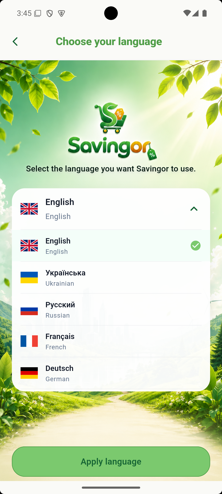
  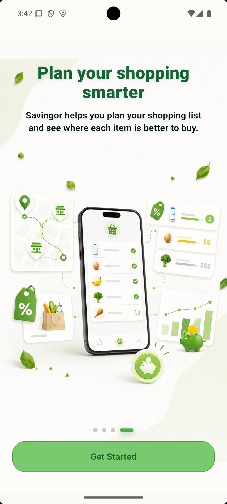
  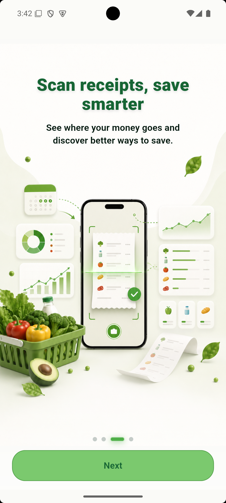
</p>
<p align="center">
  <sub>Multi-language onboarding</sub> &nbsp;&nbsp;&nbsp; <sub>Smart shopping planning</sub> &nbsp;&nbsp;&nbsp; <sub>Receipt scanning introduction</sub>
</p>
<br />

<p align="center"><strong>Authentication and dashboard</strong></p>
<p align="center">
  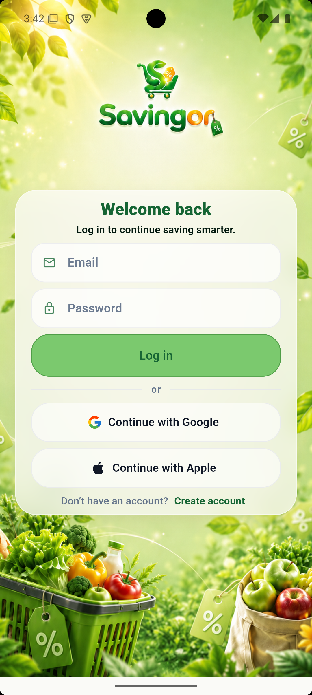
  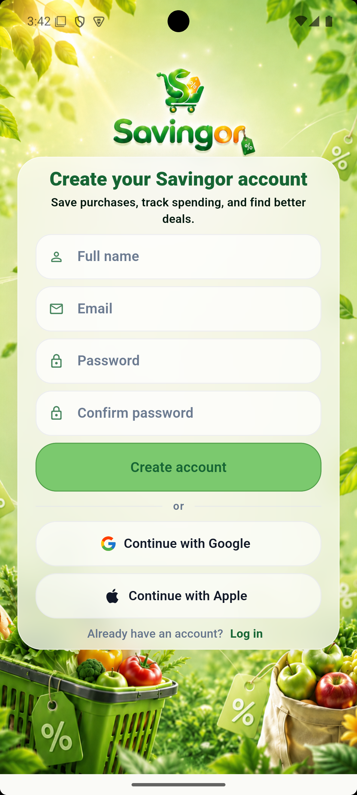
  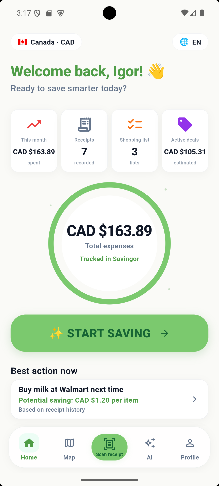
</p>
<p align="center">
  <sub>Secure sign-in</sub> &nbsp;&nbsp;&nbsp; <sub>Account registration</sub> &nbsp;&nbsp;&nbsp; <sub>Savings dashboard · Light theme</sub>
</p>
<br />

<p align="center"><strong>Core product experience</strong></p>
<p align="center">
  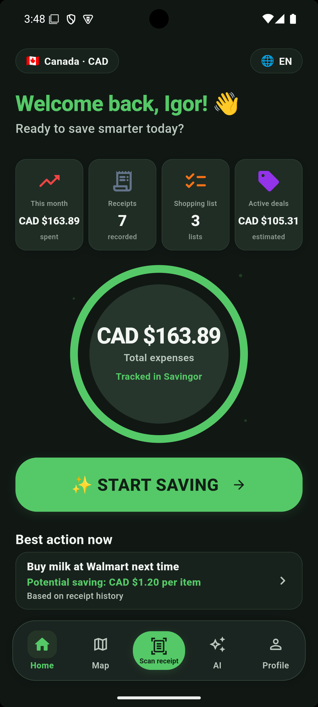
  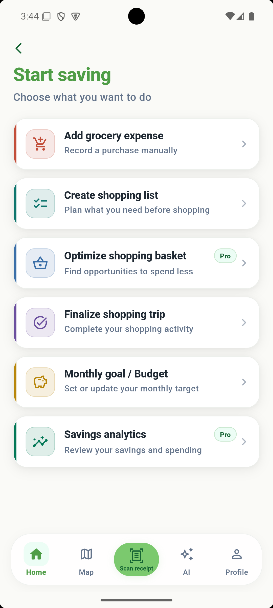
  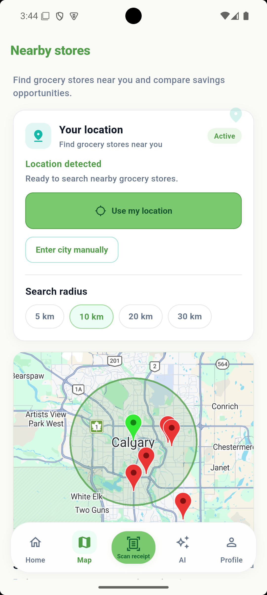
</p>
<p align="center">
  <sub>Savings dashboard · Dark theme</sub> &nbsp;&nbsp;&nbsp; <sub>Start Saving action hub</sub> &nbsp;&nbsp;&nbsp; <sub>Nearby store discovery and radius search</sub>
</p>
<br />

<p align="center"><strong>Receipt intelligence workflow</strong></p>
<p align="center">
  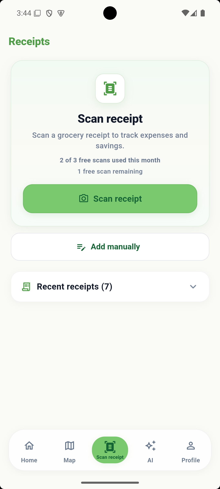
  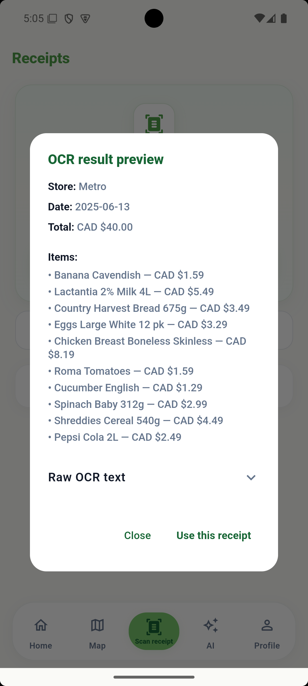
  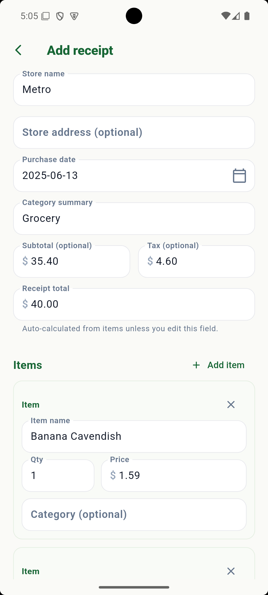
</p>
<p align="center">
  <sub>Receipt scanner</sub> &nbsp;&nbsp;&nbsp; <sub>OCR recognition preview</sub> &nbsp;&nbsp;&nbsp; <sub>Editable receipt review</sub>
</p>
<br />

<p align="center"><strong>Data and savings intelligence</strong></p>
<p align="center">
  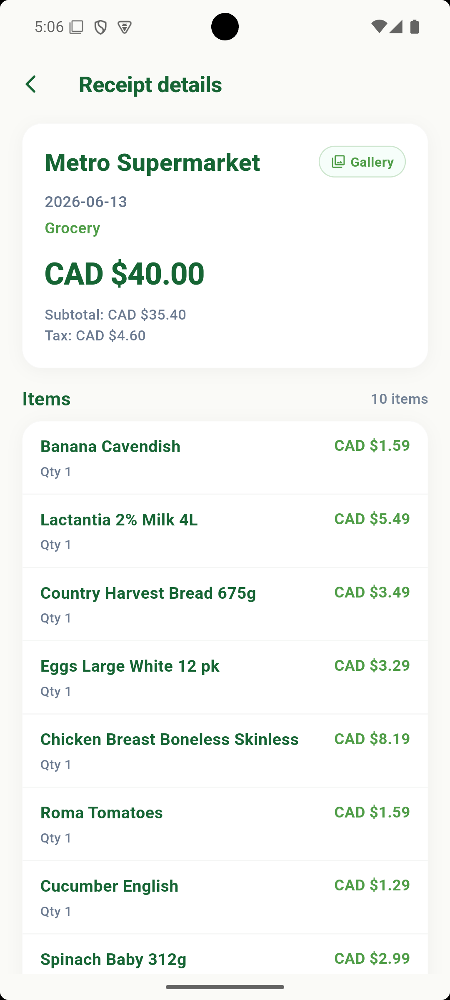
  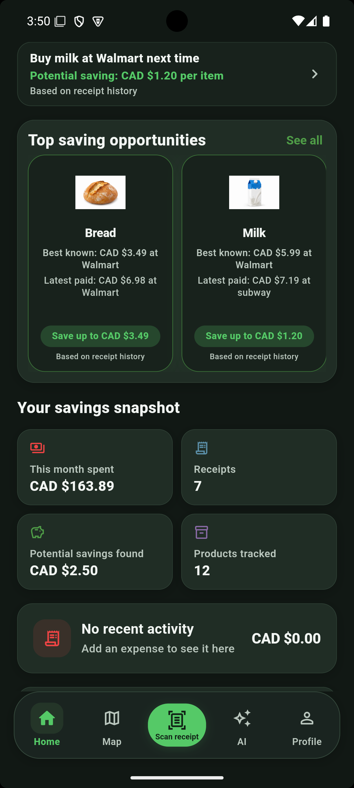
  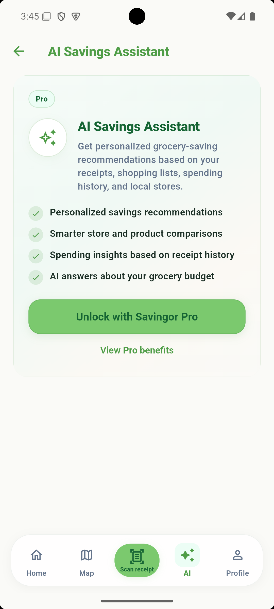
</p>
<p align="center">
  <sub>Saved receipt details</sub> &nbsp;&nbsp;&nbsp; <sub>Product savings opportunities</sub> &nbsp;&nbsp;&nbsp; <sub>AI Savings Assistant · Pro access</sub>
</p>
<br />

<p align="center"><strong>Account and monetization</strong></p>
<p align="center">
  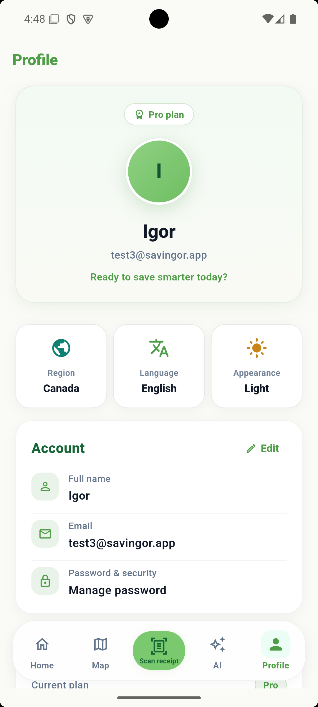
  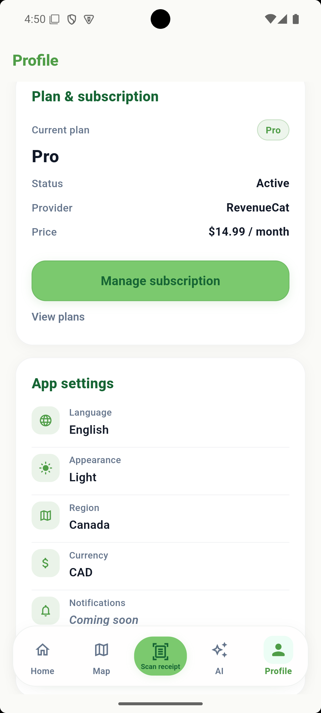
  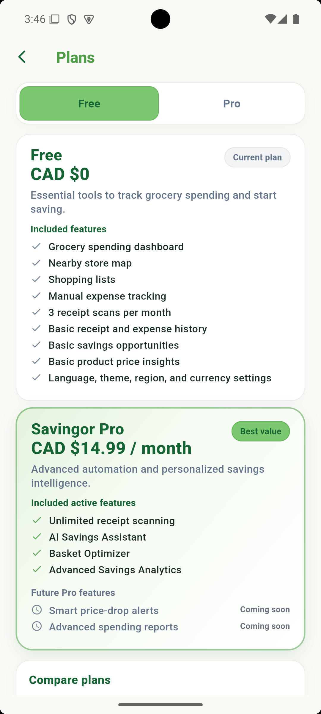
</p>
<p align="center">
  <sub>Profile and account controls</sub> &nbsp;&nbsp;&nbsp; <sub>Subscription and app settings</sub> &nbsp;&nbsp;&nbsp; <sub>Free and Pro plan comparison</sub>
</p>

---

## Key features

### Receipt intelligence

- Camera and gallery receipt input (`image_picker`)
- On-device **Google ML Kit Text Recognition** (Latin script)
- **Geometry-aware** line sorting and product/price pairing (`ReceiptOcrLayoutParser`)
- Extraction of store name, purchase date, line items, subtotal, tax, and total
- **Weighted-item parsing** (e.g. `kg @ $/kg` continuation lines paired to product rows)
- Editable review screen before saving (`CreateReceiptScreen`)
- Cloud Firestore synchronization for authenticated users
- Receipt history, detail views, and source badges (manual, scanned, gallery, shopping trip)
- Raw OCR text stored in a technical field (`ocrRawText`); user-visible **Notes** are not auto-filled from OCR

### Savings intelligence

- **Product price memory** derived from saved receipts (`PriceMemoryStore`, backed by `PriceMemoryRepository`)
- Last-paid and best-known price tracking per normalized product name
- **Basic savings opportunities** from receipt history (Free tier)
- **Basket optimizer** — matches shopping-list items to price memory and suggests store-level basket plans (Pro)
- **Savings analytics** — spending and savings-oriented dashboard views (Pro)
- **AI Savings Assistant** — OpenAI-compatible client with structured context building; Pro-gated UI with locked preview for Free users

### Core grocery tools

- **Home dashboard** — combined expense and receipt totals, quick actions, feature entry points
- **Manual grocery expenses** — add and track non-receipt spending
- **Shopping lists** — create lists, add items, manage quantities
- **Shopping-trip finalization** — convert a completed list into a receipt-style record
- **Monthly budget** — monthly goal and budget tracking screen
- **Nearby-store map** — Google Maps with grocery-store search via Google Places when configured; local mock fallback when not
- **Search radius** — 5, 10, 20, or 30 km
- **Route opening** — external maps directions launcher for selected stores

### Account and product experience

- **Firebase Authentication** (email/password sign-in and registration)
- User profile and app settings (language, appearance, region, currency)
- **Six languages**: English, Ukrainian, Russian, French, German, Spanish (Flutter ARB localization)
- **Light and Dark themes** with shared design system
- Canada-first region and **CAD** support (USD also configurable)
- Responsive Android UI with persistent bottom navigation on main tabs

### Free / Pro architecture

Access rules are centralized in `FeatureAccessPolicy` and evaluated through `FeatureAccessService`.

| Tier | Capabilities |
|------|----------------|
| **Free** | Dashboard, nearby stores, shopping lists, manual expenses, basic receipt scanning (**3 successfully saved image-based scans per calendar month**), basic price insights and savings opportunities |
| **Pro** | Unlimited receipt scanning, **AI Savings Assistant**, **Basket Optimizer**, **Savings Analytics** |

Additional Pro-only identifiers exist in the access policy for future capabilities (price-drop alerts, advanced reports, etc.) but are not fully productized yet.

- **Debug-only Free / Pro override** via `DebugSubscriptionOverrideStore`, disabled in release builds (`kDebugMode` guard)
- **RevenueCat SDK** (`purchases_flutter`) integrated with demo fallback when public SDK keys are not supplied at build time

---

## Verified OCR case study (Metro supermarket receipt)

This workflow was manually verified end-to-end on Android and is protected by automated regression tests.

1. **Gallery image selected** on the receipt scanner screen.
2. **ML Kit OCR** returned text blocks with per-line bounding boxes (geometry).
3. The **layout-aware parser** extracted:
   - Store name (Metro / Metro Supermarket)
   - Purchase date
   - Subtotal **35.40**, tax **4.60**, total **40.00**
   - **10 grocery product rows**, including weighted items
4. **Weighted items** were paired correctly — e.g. Chicken Breast Boneless Skinless → **8.19**, Roma Tomatoes → **1.59** — by associating weight/`$/kg` continuation lines to the nearest product cluster above.
5. The user **reviewed and corrected** editable fields (store, date, line items) before saving.
6. The receipt was **saved to Firestore**; dashboard totals and receipt count updated reactively via `ReceiptStore` listeners.
7. **Free monthly scan usage incremented only after a successful saved scan** (gallery/scanned sources count toward the limit; manual entry and edits do not consume an additional scan).

Regression coverage: `test/features/scanner/data/receipt_ocr_metro_layout_test.dart` (14 tests), plus parser, draft-mapping, and scan-pipeline tests.

---

## Architecture

Savingor uses a **feature-oriented** layout under `lib/features/`, with shared infrastructure in `lib/core/` and app shell/routing in `lib/app/`.

Typical feature module structure:

```
feature/
├── presentation/   # screens and widgets
├── domain/         # models, policies, pure logic
└── data/           # Firestore services, stores, repositories
```

Cross-cutting layers:

- **`lib/app/router/`** — GoRouter configuration, onboarding gates, shell routes
- **`lib/core/theme/`** — light/dark `ThemeData`, design tokens, `SavingorThemeExtension`
- **`lib/core/widgets/`** — shared UI primitives (bottom nav shell, screen states)
- **`lib/l10n/`** — ARB source files and generated `AppLocalizations`
- **`test/`** — unit and widget tests mirroring feature boundaries

State is primarily **InheritedNotifier / ChangeNotifier stores** (receipts, expenses, shopping lists, price memory, subscription) wired in `main.dart`.

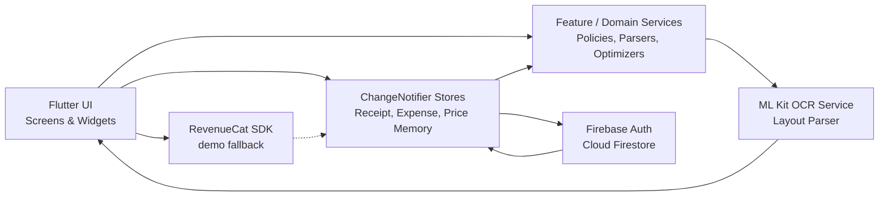

---

## OCR pipeline

```
Image Picker (camera / gallery)
        ↓
Google ML Kit Text Recognition (Latin)
        ↓
ReceiptOcrResult (raw text + line geometry)
        ↓
ReceiptOcrParser → ReceiptOcrLayoutParser (when geometry present)
        ↓
ReceiptOcrDraftMapper → editable receipt draft
        ↓
User review & confirmation (CreateReceiptScreen)
        ↓
ReceiptStore → Firestore save
        ↓
Dashboard, analytics inputs, price-memory sync
```

**Conservative parsing principles** (implemented in `ReceiptOcrLayoutParser` and tests):

- Uncertain values remain editable; low-confidence lines may appear with zero price for manual completion
- Merchant headers, addresses, timestamps, payment references, and footer lines are filtered from product rows
- Package sizes (`675g`, `4L`, etc.) are preserved in names and not treated as monetary prices
- Per-unit rates (`/kg`) are distinguished from line totals
- Visual sort order uses bounding-box **Y then X**, not raw block index order
- Flat-text fallback path stays conservative when geometry is unavailable

---

## Technology stack

Technologies present in this repository:

| Layer | Technology |
|-------|------------|
| Mobile framework | **Flutter / Dart** (SDK `^3.5.3`) |
| Navigation | **go_router** |
| Backend | **Firebase Authentication**, **Cloud Firestore** |
| Local persistence | **shared_preferences** |
| OCR | **google_mlkit_text_recognition** |
| Maps & location | **google_maps_flutter**, **geolocator**, Google Places HTTP integration |
| Subscriptions | **purchases_flutter** (RevenueCat), demo fallback |
| AI assistant | **http** client → OpenAI-compatible API (`--dart-define`) |
| Localization | Flutter **gen-l10n** with ARB files |
| UI assets | **flutter_svg** |
| Android build | **Gradle**, `compileSdk 35`, ProGuard rules for ML Kit release builds |
| Testing | **flutter_test**, **flutter_lints** |

---

## Testing and quality

Verified locally (portfolio freeze baseline):

| Check | Result |
|-------|--------|
| `flutter analyze` | **No issues found** |
| `flutter test` | **108 tests passed** |
| Metro OCR regression | **14 tests passed** (`receipt_ocr_metro_layout_test.dart`) |
| `flutter build apk --release` | **Success** |

Automated coverage includes:

- Receipt parsing and geometry-aware product/price pairing
- Weighted product continuation lines
- OCR draft mapping (Notes vs `ocrRawText` separation)
- Receipt save / scan-limit pipeline
- Free / Pro access policy and effective subscription resolution
- Subscription presentation widgets
- Debug subscription override store (`kDebugMode` behavior)

Not every UI screen or navigation path has automated widget/integration coverage.

```bash
flutter analyze
flutter test
flutter test test/features/scanner/data/receipt_ocr_metro_layout_test.dart
```

---

## Demo

<!-- TODO: Add a short screen-recording demo (MP4 or GIF) and link it here. -->
<!-- TODO: Add a hosted APK or GitHub Release asset link for reviewers. -->

- **Demo video:** _Coming soon_
- **APK / demo build:** _Coming soon_ — build locally with the commands in [Local setup](#local-setup)

---

## Local setup

### Prerequisites

- **Flutter SDK** compatible with Dart `^3.5.3` (Flutter 3.24+ per lockfile)
- Android SDK / device or emulator for primary testing
- A **Firebase project** with Authentication and Firestore enabled

### Clone and install

```bash
git clone https://github.com/vodolij888Igor/savingor_app.git
cd savingor_app
flutter pub get
```

### Firebase configuration

The app calls `Firebase.initializeApp()` at startup. For Android, add your own Firebase project configuration file at `android/app/google-services.json`. Firebase client configuration is project-specific; production security must rely on Firebase Authentication, correctly configured Firestore Security Rules, and appropriate API restrictions.

Enable Firebase Authentication (Email/Password) and configure Firestore Security Rules for your environment.

### Optional build-time defines

Supply keys via `--dart-define` (never commit real values to source control):

```bash
# Google Places (nearby grocery search on the map)
--dart-define=GOOGLE_PLACES_API_KEY=YOUR_KEY

# RevenueCat public SDK keys (subscriptions; omit for demo-fallback mode)
--dart-define=REVENUECAT_ANDROID_API_KEY=YOUR_PUBLIC_KEY
--dart-define=REVENUECAT_IOS_API_KEY=YOUR_PUBLIC_KEY

# AI Savings Assistant (Pro feature; omit for configured-but-disabled mode)
--dart-define=OPENAI_API_KEY=YOUR_KEY
--dart-define=OPENAI_MODEL=gpt-4o-mini
```

Google Maps on Android reads `GOOGLE_PLACES_API_KEY` from Gradle `dart-defines` for manifest placeholders.

### Run, analyze, test, and build

```bash
flutter run

flutter analyze
flutter test

# Debug APK
flutter build apk --debug

# Release APK
flutter build apk --release
```

---

## Project limitations

- **OCR accuracy varies** with image quality, lighting, crumpling, and receipt layout; users can always review and correct results before saving.
- **Nearby stores** use Google Places when a key and location are available; otherwise the app falls back to curated mock store data.
- **AI assistant keys** are supplied via build-time defines in development builds; a backend-protected key is planned for production (see [Roadmap](#roadmap)).
- **Deployment constraints** (store publication, production billing, release signing) are summarized in [Project status](#project-status) and tracked as future work in [Roadmap](#roadmap).

---

## Engineering capabilities demonstrated

Savingor reflects hands-on software engineering across a full mobile product stack. The repository contains implemented work—not roadmap placeholders—including Flutter application architecture, Firebase Authentication and Firestore, receipt OCR with geometry-aware parsing, grocery expense and shopping workflows, price-memory logic, Free / Pro access control, maps and location services, localization, automated testing, and Android release build configuration.

This project demonstrates the following engineering capabilities:

- **Mobile application architecture** — feature-oriented modules, routing, and shared design system
- **Flutter and Dart development** — screens, widgets, state management, and navigation
- **Firebase backend integration** — authentication, Firestore-backed stores, reactive UI updates
- **OCR and document parsing** — ML Kit integration, layout heuristics, weighted-line pairing, metadata filtering
- **Reactive data synchronization** — ChangeNotifier stores with Firestore streams and derived dashboard state
- **AI feature integration** — structured context building, Pro-gated assistant UI, OpenAI-compatible client architecture
- **Free / Pro access-control architecture** — centralized policy, scan limits, RevenueCat-ready subscription layer
- **Maps and location services** — Google Maps, geolocation, Places search with mock fallback
- **Localization and theming** — six-language ARB localization, light/dark themes
- **Automated testing** — parser regressions, access policy, subscription presentation, scan-pipeline tests
- **Android build configuration** — debug and release APK builds, ProGuard rules for ML Kit
- **Product-oriented debugging and delivery** — real receipt-layout edge cases, portfolio documentation, demo-ready builds

Future roadmap items (production billing, backend-protected AI keys, price-drop alerts, advanced reports, store publication) are architecturally anticipated but not represented as completed deliverables in this repository.

### Relevant roles

- Software Developer
- Flutter Developer
- Mobile Application Developer
- AI Integration Developer
- Firebase Developer
- Full-Stack AI Product Developer

---

## Roadmap

Future work (not yet delivered):

- Production **Google Play billing** via RevenueCat and configured store products
- Broader receipt-layout validation beyond current Metro-focused regression fixture
- **Smart price-drop alerts**
- **Advanced spending reports**
- **Backend-protected AI key** (replace direct client OpenAI calls)
- Expanded **store and deal data** sources
- **Google Play publication** with production signing and release pipeline

---

## Repository structure

```
savingor_app/
├── android/                 # Android Gradle project, google-services, ProGuard
├── ios/                     # iOS runner (secondary target)
├── assets/                  # Images, flags, product placeholders
├── docs/                    # Product/architecture notes (see also this README)
├── lib/
│   ├── app/                 # Router, shell screens
│   ├── core/                # Theme, widgets, config, services, i18n helpers
│   ├── features/
│   │   ├── ai_assistant/    # AI savings assistant (Pro)
│   │   ├── analytics/       # Savings analytics (Pro)
│   │   ├── budget/          # Monthly budget
│   │   ├── deals/           # Nearby stores, map, Places integration
│   │   ├── expenses/        # Manual grocery expenses
│   │   ├── home/            # Dashboard
│   │   ├── onboarding/      # Splash, language, auth
│   │   ├── price_memory/    # Price memory, basket optimizer, opportunities
│   │   ├── profile/         # Profile and settings
│   │   ├── receipts/        # Shared receipt models and widgets
│   │   ├── scanner/         # OCR, parsing, receipt CRUD UI
│   │   ├── shopping/        # Shopping lists and trip finalization
│   │   ├── start_saving/    # Savings hub entry screen
│   │   └── subscription/    # Free/Pro plans and access gates
│   ├── l10n/                # ARB files + generated localizations
│   └── main.dart            # App entry, provider wiring
├── test/                    # Unit and widget tests
├── l10n.yaml                # Localization code generation config
└── pubspec.yaml             # Dependencies and assets
```

---

## License

No open-source license file is included in this repository at present.

The codebase is provided for **portfolio demonstration and technical evaluation**. Contact the repository owner for licensing or usage questions.

---

## Additional documentation

- [`docs/PRODUCT_BRIEF.md`](docs/PRODUCT_BRIEF.md) — early product context (partially superseded by current implementation)
- [`docs/ARCHITECTURE.md`](docs/ARCHITECTURE.md) — **historical** early MVP architecture notes (superseded by the current `lib/features/` layout; do not treat as current routing or module structure)
